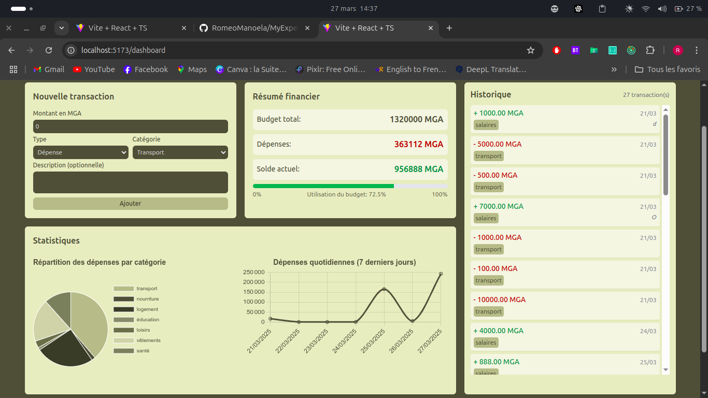

# MyExpense

Une application web de suivi des dépenses personnelles permettant de gérer efficacement mes finances.

## 📊 Fonctionnalités

- Authentification sécurisée par JWT avec cookies HTTP-only
- Gestion complète des transactions (dépenses et revenus)
- Visualisation intuitive des dépenses par catégorie
- Tableaux de bord interactifs avec graphiques et statistiques
- Interface responsive adaptée à tous les appareils

## 🛠️ Technologies

### Frontend

- React 19 avec TypeScript
- Redux Toolkit pour la gestion d'état
- React Router v7
- Chart.js pour les visualisations
- Tailwind CSS pour le design
- Vite pour le bundling

### Backend

- Django avec Django REST Framework
- Authentification JWT sécurisée
- Base de données PostgreSQL

## 🚀 Installation

### Prérequis

- Node.js (v18+)
- Python (v3.10+)
- npm ou yarn
- PostgreSQL

### Configuration du frontend

```bash
# Cloner le dépôt
git clone https://github.com/RomeoManoela/MyExpense.git
cd MyExpense

# Installer les dépendances frontend
cd frontend
npm install

# Lancer le serveur de développement
npm run dev
```

### Configuration du backend

```bash
# Créer un environnement virtuel
cd backend
python -m venv .venv  # ou python3 -m venv .venv
source .venv/bin/activate  # Sur Windows: .venv\Scripts\activate

# Installer les dépendances
pip install -r requirements.txt # ou pip3 install -r requirements.txt
```

Créer un fichier `.env` dans le dossier backend avec:

```
POSTGRES_DB=r_expense
POSTGRES_USER=votre_utilisateur
POSTGRES_PASSWORD=votre_mot_de_passe
POSTGRES_HOST=localhost
POSTGRES_PORT=5432
```

```bash
# Appliquer les migrations
python manage.py migrate # ou python3 manage.py migrate

# Lancer le serveur
python manage.py runserver 8001 # ou python3 manage.py runserver 8001
```

## 📷 Captures d'écran


*Dashboard principal avec graphiques et historique des transactions*

## 📝 Licence

MIT

## 👨‍💻 Auteur

Créé par Roméo Manoela
